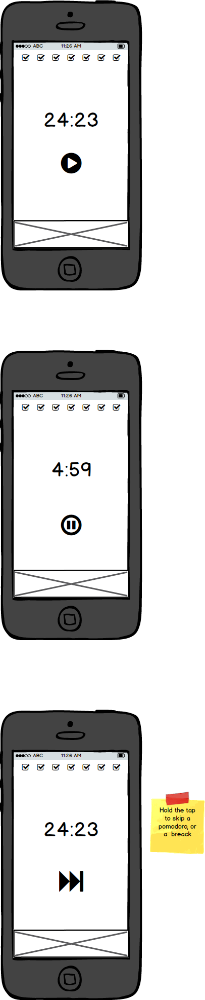

# MaKondo Pomodoro

The hole idea is just to rely on a tap and a hold, so if you tap once you will pause the timer, if you tap again you will resume the timer, the same goes for break's.

If you want to skip a break or pomodoro, you'll have to hold down 3 seconds, and that's it.

##First Iteration

[ ] - As a developer I'll want to have a timer that rings every 25 minutes
[ ] - After those 25 minutes I Want to have 5 minutes, and a ring again.
